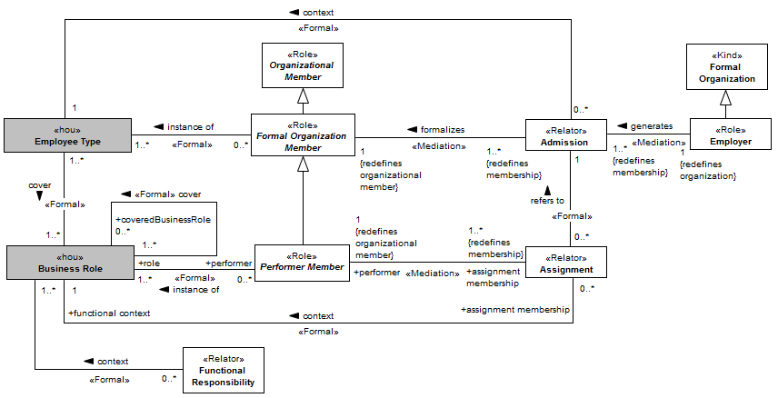

[< Back](../README.md)

---

# Allocation View

The allocation view describes the establishment of the relation between the members of the organization and the organization itself, including its sub-organizations. The Figure bellow presents the most basic arrangement for the definition of a member of the organization. Here, we are only concerned with human agents, and thus the physical agents we refer to are human beings, i.e., natural persons. The association of natural persons to an organization is an essential part of the definition of organizations, being defined by an organizational membership. By becoming an organizational member, a natural person is inserted among a group of agents that comprise the organization. An organizational member is the most generic denomination of a member of the organization is refined in more specific types of members, according to the allocation type (admission or assignment). 

In the scope of each organization, different specializations of these more general roles are required. For example, in a university, employee types such as “University Professor” and “Secretary” become relevant, while in a hospital employee types such as “Doctor” and “Nurse” may be defined. Therefore O3 includes the second-order notions of employee type and other business roles. They are to be instantiated in particular settings creating thus specific roles. The instances of employee type extend formal organization member, and the instances of business role extend either structural unit member or missionary unit member. We represent them by following the UML’s “powertype” representation pattern with the second-order concept stereotyped <\<hou\>> (for higher order universal), highlighted in gray. Due to this, the user of the ontology can develop an extension that includes specific roles to his/her domain of interest. The Figure bellow illustrates this setting.
  

The next two Figures present in details the concepts related with the agents that compose the organization and the types of roles they may play. In these fragments, we are concerned with the specific roles that natural persons play, first of all as a member of a formal organization (Formal Organization Member), and then when they are given more specific places in the power structure, either in a structural (line or staff) unit (Structural Unit Member) or in missionary units (Missionary Unit Member). Note that in order to play a particular role in an organizational unit, a person needs to be a formal organization member first. The Figure bellow defines in detail the existing formal relation between an employee and a formal organization.

The association between an individual and an organization is accomplished through an admission or an assignment. When an individual becomes an employee (Formal Organization Member) of an organization, her formal “link” with the employer is the action of admission. The admission defines, in a general way, the expected behavior and constraints through the association of the individual with an employee type. In addition, an admission is recognized by the external environment, e.g., a real estate recognizes that Paul is a mechanical engineer (his profession) in a lease process.

Specific employee types define the set of roles (business roles) that a typified employee can occupy in the organization (through the “cover” relationship). Business roles define more specific capabilities, duties and prerogatives possibly in the scope of organizational units. Thus, business roles are more committed with the expected behavior than employee types once aggregate functional responsibilities. 

Formal organization members assigned to business roles are named performer member. In this scope, the allocation is limited to only the definition of functional responsibilities and does not extend to the allocation in organizational units. This setting fits perfectly with organizations that are not constituted by organizational units (simple standalone functional/missionary organizations). The Figure bellow defines in detail the existing relation between an employee and organizational units.

Within the organization, an employee must be assigned to an organizational unit to assume a specific role and consequently a specific function. An assignment is recognized only in the internal context of the organization and can be structural (structural assignment) or missionary (missionary assignment). When an assignment is related with the allocation of an employee to a structural unit, the individual becomes a structural unit member, whose subclasses are instances of structural business role. An employee allocated to a structural unit must play a structural business role; on the other hand, employees assigned to missionary units play missionary business roles. This type of assignment represents for example the association of John to the role of “system analyst” in the “IT department”.
Organizations that adopt the matrix structure can perform multiple assignments of “functions” to their employees. Generally, an employee is allocated to only one structural unit, but it is possible that the same employee is assigned to different missionary units, with different missionary business roles. When associated to a missionary unit, an employee becomes a missionary unit member. The specializations of the concept missionary unit member are instances of missionary business role.

When assigned to an organizational unit, an employee has a defined “function” formalized in the specification of the business role, which defines in detail its expected behavior and authority relationships. The accumulation of “functions” by an employee can be simultaneous or at different time periods. The assignments are only possible if the individual is member of the organization, not being possible, for example, that John is allocated (by an assignment) to an organizational unit if he is not a member of the organization or a member of another organization. Thus, the assignments are tied with the admission that made the individual a member of the organization, which is defined through the relationship “refers to”. 

Admissions and assignments can be performed through many actions (e.g., an election, an appointment), each of these defining a different member. The Figure bellow describe in detail the multiple membership forms. 

Before discussing the many forms of membership (admission and assignment), we need first to define election and appointment. An election is a process to select one among many candidates. In an election many electors participate with votes to a specific candidate. The candidate with the most votes is selected. In contrast, an appointment is performed by a nominator in favor of other. 

In the organizational context, an employee may be admitted or assigned by different forms. An effective membership is the most common admission/assignment type and represents an admission/assignment following the usual process. Other forms of membership include appointments and elections. When an employee is admitted as consequence of an appointment, the resulted admission/assignment is a membership by appointment. An appointment need not necessarily be performed by members of the organization. In the case of O3, a natural person or a social agent can “realizes” an appointment. Finally, an employee can be elected by a group of natural person or social agents, which “participates” of its selection. The presence of social agents in appointment process can be observed, for example, United Nations Council. The General Secretary is appointed by the General Assembly, after being recommended by the Security Council. The members of General Assembly are governments, which represents social agents.

The following Table presents the constraints that must be observed on analyzing or instantiating the concepts of the Allocation View.

|ID | Description |
|----------|-----------------------|
|AXI15|	Every member of an organizational unit should be employee (Formal Organization Member) of the “Formal Organization” to which the “Organizational Unit” is related (component of relationship).|
|AXI16|	An employee (Formal Organization Member) can only assume a “Business Role” inherent to the “Organizational Unit” to which he/she belongs.|
|AXI17|	An instance of "Business Role" cannot establish a relationship "covers" with itself.|
|AXI18|	Assignments should be performed in the context of a specific “Admission” in an organization (Formal Organization), i.e., an instance of "Formal Organization Member", which was admitted by an admission a1, cannot have a related assignment with an admission a2.|