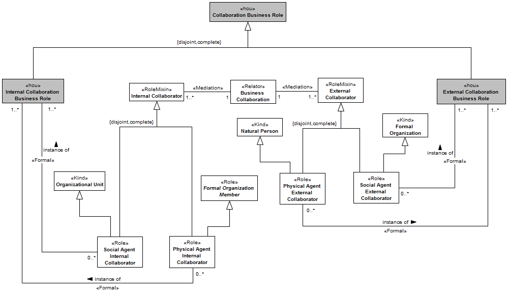
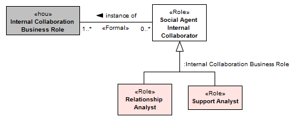

[< Back](../README.md)

---

# Business Collaboration View

The business collaboration view describes the external organizational interactions and their participants. Despite the effort to define organizations as a unit, the view that organizations are inserted in a broad collaborative and dependent environment is defended as the path to business survival. Organizations think of themselves as teams that create value jointly rather than as autonomous companies that are in competition with all others (DAFT, 2010). An organization interacts with suppliers to get its inputs, and, surely, interacts with its customers to sell its products or services. These interactions are called business collaborations. The knowledge about the context of the organizations is essential to business strategy, as a way to adapt the organizational behavior to the changes and opportunities (DAFT, 2010). The Figure bellow presents the roles involved in business collaborations.

Business collaborations involve two distinct parts that work together to perform a collective behavior, an internal and an external part. Internal participants are namely internal collaborators and represent the organization as a whole (e.g., sales department, business agent). On the other hand, external participants are called external collaborators and represent the organizational environment (e.g., a supplier, a customer, an audit organization). Social agents or physical agents may get involved in a business collaboration. When an organizational unit (social agent) becomes an internal collaborator it plays the role of social agent internal collaborator. Similarly, when a formal organization member (physical agent) becomes an internal collaborator she plays the role of physical agent internal collaborator. 

An internal collaboration business role specifies the expected behavior of an internal agent when participating in a business collaboration. The specializations of both specializations of internal collaborator are instances of internal collaboration business role. This means that the specializations of both, social agent internal collaborator and physical agent internal collaborator, have as power type the internal collaboration business role concept. Due to this fact we can define types of roles explicitly in the model through specialization of these concepts, as shown in The Figure bellow.

Finally, when an organizational unit (social agent) becomes an external collaborator, it plays the role of social agent external collaborator. In the same way, when a natural person (physical agent) becomes an external collaborator, he/she plays the role of physical agent external collaborator. An external collaboration business role specifies the expected behavior of an external agent when participating in a business collaboration. The specializations of both specializations of external collaborator are instances of external collaboration business role. 