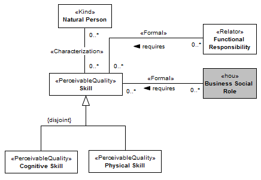

[< Back](../README.md)

---

# Capability View

The capability view describes the organizational members’ characteristics relevant to performing their duties. Natural persons can be described by their physical and mental characteristics, like height, weight and temperament. These characteristics manifest themselves in the form of skills. In the organizational context, we are only interested in the subset of skills needed to carry out business tasks. The Figure bellow presents the relationship between the required skills and the inherent skills of a natural person.

As defined in (FAYOL, 1949), each group of operations or functions corresponds to a special ability (skill). There are technical abilities, commercial abilities, financial abilities, administrative abilities, etc. The set of essential qualities and knowledge comprises physical, intellectual and moral qualities, general knowledge, experience and certain special knowledge regarding with a function to perform. This set of skills represent the requirements to engage in business social roles. In the scope of this work, we cover only physical and intellectual qualities, here called respectively, physical skill and cognitive skill. Examples of skills includes UML modeling, java programing, bridge structural design, flying aircraft, fast running and carrying heavy weights.