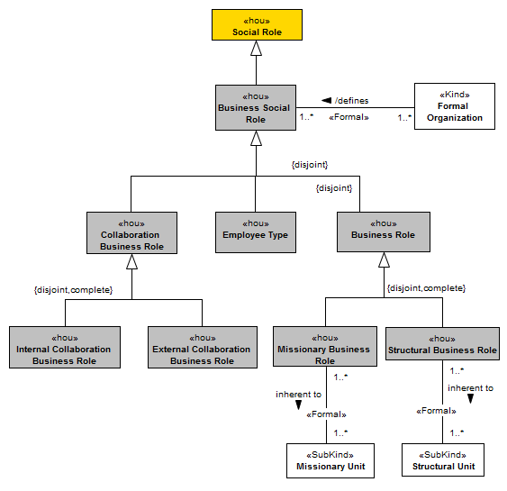
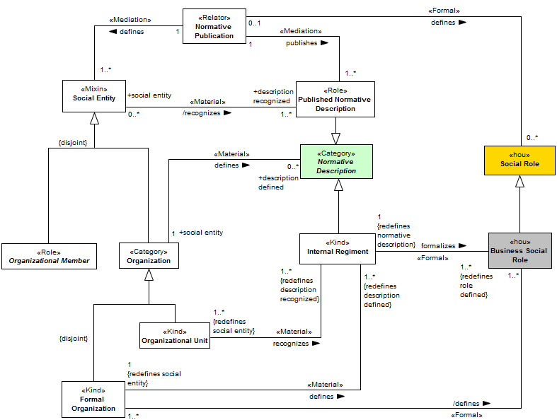
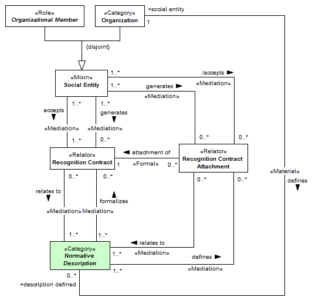

[< Back](../README.md)

---

# Organizational Roles View

The organizational role view describes the roles that specify the expected behavior of the organizational members. As a consequence of the independent nature of organizations, the individuals (natural persons) that compose an organization can change over time. The defined set of roles has the purpose of keeping the organization on course of their goals while maintaining the uniformity of the expected behavior of its members. These roles are called social roles and are defined by normative descriptions. The establishment of social roles by a recognized authority is fundamental, once only the recognition of its act assigns validity to the characteristics inherent to the role. The Figure bellow presents the social role hierarchy.

The main concept, business social role, describes a role defined and valid on the scope of an organization. It is refined in business role, employee type and collaboration business role. The complete specialization hierarchy of business social roles encompasses the roles presented in Figure above. Here, we will not go into more detail about the taxonomy of business roles, as these concepts will be defined in later sections.

In an organizational structure description, it is important to define the relationship between the behaviors of the individuals with the collective behavior. In this context, we can describe the behavior of an organizational units by the specification of a set of business roles (through the “inherent to” relationship). For example, it’s very natural to say that the Sales Department is associated with the Salesman and the Sales Manager roles. This association does not bind the people with an organizational unit, but specify the behavior that the members of it have to assume. The Figure bellow presents the recognition chain between organizations and their members, normative descriptions and social roles. The fragment presented in Figure bellow comprises an upper vision about “recognition” relationships, which are extended to create specific relationships to the active structure domain. 

In organizational scope, we have a special type of social role, namely business social roles, which are formalized by internal regiments. An internal regiment is a specific type of normative description and has its scope limited to the organization. Formal organizations define internal regiments to describe formally their roles, which are recognized by their organizational units and members. 

In an upper view of the “recognition” subject, we have normative descriptions as a central part. A normative description, as defined in (GUIZZARDI; FALBO; GUIZZARDI, 2008), defines one or more rules/norms recognized by at least one social agent. We extend here the notion of recognition defining social entity. The essence of organizations is social, but, as a social agent, an organization is composed by natural persons. Within the organization, a natural person assumes a social role against the whole, becoming a social entity. The difference between organizations and organizational members as social entities lies in the fact that an organization always will be a social entity, while an organizational member may cease their role in the organization. At this level of analysis, normative descriptions may be defined by organizations. In a lower view, the “defines” relationship between formal organization and internal regiment is “redefined”. At this configuration only formal organization are entities with the right of defining normative descriptions. The Figure bellow extends the concept of recognition illustrating the discussion about recognition contracts.

Like living organisms, organizations adapt to changes in their external environment. Organizational evolution generally comes with changes in organizational structure (departments and roles). The maintenance of the formal environment is coupled with continuity of the formal recognition by the individual and collective agents against the organizational definitions. Here, we call definition every role defined, every organizational unit create. With this in mind, a recognition contract describes a formal agreement between social entities. On one side, a social entity creates (generates) the recognition contract and its attachments (maybe at a later time). On the other side, the recognition contract and attachments are accepted and consequently the normative descriptions associated with the contract also are recognized. 

Normative descriptions can be related with many recognition contract (and its attachments). In contrast, a specific recognition contract may be related with one or more normative descriptions. 

To visualize this recognition arrangement, take the following example. A software development company decided to terminate the “mathematical models department”. For this, the organization has created new positions to meet the functional need and relocated former members of the “mathematical models department” to other departments. For such changes to be valid, it is necessary that all members of the organization recognize its legitimacy. We can observe this scenario as an update of an existing recognition contract. In this case, a recognition contract attachment is associated with the normative description that formalizes the creation of the new position. The “accepts” relationship between the social entity and the recognition contract attachment is derived by the specification of the relationship of “attachment of” between the recognition contract attachment and the recognition contract. Note that we not intent to enter in legal matter about additional agreements on updating an existing agreement. Our purpose here is to describe the continuous formal characteristic of organizational acts.

The following Table presents the constraints that must be observed on analyzing or instantiating of the concepts of the Organizational Role View.

|ID | Description |
|----------|-----------------------|
|AXI10|	A “Social Entity” that defines a “Normative Description” should compulsorily recognize it.|
|AXI11|	If an “Organization” recognizes a “Normative Description”, automatically its members should also recognize it.|
|AXI12|	A “Structural Business Role” inherent to a “Structural Unit” will result in a definition relationship between the organization as a whole and the business role.|
|AXI13|	A “Missionary Business Role” inherent to a “Missionary Unit” will result in a definition relationship between the organization as a whole and the business role.|
|AXI14|	If a social entity accepts (recognizes) a Recognition Contract then this entity must also recognize the Normative Descriptions associated with this contract.|