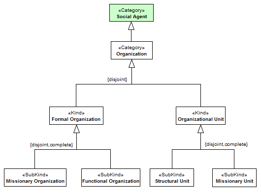
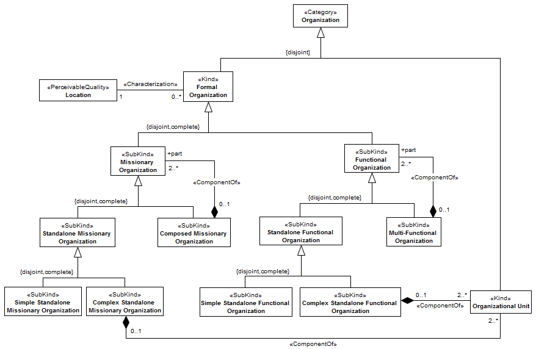
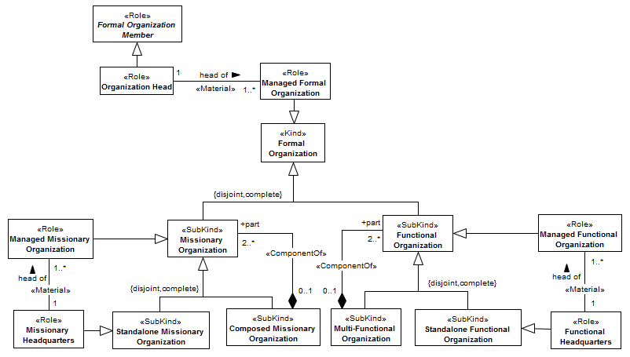
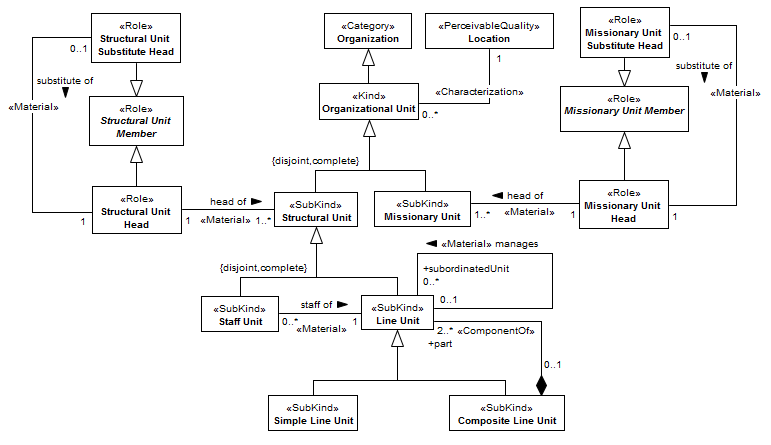

[< Back](../README.md)

---

# Organizational Structure View

The organizational structure view describes the structure of organizations, more precisely how organizations are structured in other organizations and working groups. It concerns the definition of social agents that together composes the abstract concept of organization. The Figure bellow presents an overview of the decomposition of an organization in specific social agents.

The top-most concept is Organization, specializing the UFO notion of Social Agent. As defined in (FOX, 1992), organizations are (artificial) social units built with the explicit intention of pursuing goals. Organizations include corporations, armies, hospitals and churches, but exclude tribes, ethnic groups, families and groups of friends. Organizations are characterized by division of labor, presence of one or more power centers that control the combined efforts of the organization and coordinate activities to achieve goals. Members of an organization can be replaced or relocated to other functions without the organization ceasing to exist. An organization may be structured into other social agents that together contribute to the operation or behavior of the whole, defining thus what is called a functional complex in (RADNER, 1990). See (WEBER; ROTH; WITTICH, 1968) for a discussion on the whole-part relation of UFO applied at the organizational context.

We refine organizations into formal organizations and organizational units. Formal organizations are formally recognized by the external environment. Their creation is determined by normative descriptions or speech acts which are recognized by the normative context in which formal organizations exist. Work groups and human agents playing the roles that define the behavior of the organization (called here employee types, described in organizational role structure) constitute the formal organization. Examples of formal organization include Microsoft Inc., the UK Government and the Federal University of Espírito Santo. The Figure bellow presents the detailed description of formal organizations.

Formal organizations that have as their main purpose the provision of services or products (functional purpose) are called functional organizations. On the other hand, organizations that have a temporary, deliberative or that are designed to perform a specific task without the figure of a customer order are namely missionary organizations. Examples of missionary organizations include United Nations (UN), World Trade Organization (WTO) and W3C consortium.

Activities in its highest abstraction level are treated by formal organizations, which by division of labor principle decompose the activities to their parts. Formal organizations can be decomposed in other formal organizations, configuration very common in multinational companies. Missionary organizations that are composed by others missionary organizations are called complex missionary organization, in contrast simple missionary organizations do not have subparts. Similarly, composed functional organizations are namely multi-functional organizations and describe a unified abstract representation of organizations with many formal branches. We have to be very careful in defining multi-functional organizations. This kind of organization is concrete in the meaning of recognition by its external environment and identity, but in practice represents the union of its representations (branches). On the other hand standalone functional organizations are not decomposed in others functional organizations. Finally, standalone functional organizations can be structured internally in organizational units. Standalone functional organizations decomposed in organizational units are denominated complex standalone functional organizations, while those that are not are called simple standalone functional organizations. 

Despite the fact of some organizations are known and operate only in the virtual field, all formal organizations are located in some location as a requirement of recognition by their external environment. The Figure bellow illustrates upper leadership in organizations.

Generally organizations are structured in hierarchical way with more or less levels. In the organizational domain, the top of the hierarchy is the head of the organization. In O3, the head of a formal organization is defined through the “head of” relationship. The head is a member of the organization, namely formal organization member (described in detail in allocation view). In the same way, organizations may be led by their headquarters. In this case, a social agent plays the role of being headquarter (missionary headquarters and functional headquarters). The Figure bellow defines in detail organizational units.

Organizational units are those organizations that are only recognized in the internal context of a formal organization and represent the working groups of a formal organization. An organizational unit can be a structural unit or a missionary unit. Structural units are closely related to the functional structure of the organization. A missionary unit is related to the matrix structure of a formal organization and concerns to solve recurring or/and temporary problems. A feature of this type of work group is the aggregation of actors belonging to different line units, besides being able to have a limited lifetime. Examples of missionary unit include an ERP Project Team, an Audit Committee and a Financial Task Force. 

Structural units include line units and staff units. A line unit has authority relationships with other line units (upper or lower). Such relationships result in a hierarchy of authority. Furthermore, it may be composed of other line units, resulting in a relationship of authority (represented by the relationship “manages”) between parts. The justification for the structuring of line units through two distinct relationships (whole-part and authority) lies in the fact that the whole-part relationship (in the organizational domain) naturally implies power, but power does not imply a whole-part relation. Examples of line unit include a Marketing Department, a Board of Directors and a Sales Division. As seen in Section 2.2.3, a staff unit is a “counselor” unit, which has no administrative authority, thus it is not part of the line hierarchy composed by line units. Although they have no line authority, staff units relate to line units through the relation “staff of”, which determines the line unit to which a staff unit responds. Examples of staff unit: a Group of Financial Advisors and an Internal Audit Group. 

Similarly to what happens on the upper level, organizational units are also headed. In this case, only members of an organizational unit may take a command post, named "Structural Unit Head" and "Missionary Unit Head" respectively for "Structural Units" and "Missionary Units". In organizations, it is common to define substitute leader. This stems from the fact that organizations are impersonal and beyond the composition of its members. Thus, the absence of a member cannot affect the operation of the organization. Substitute takes charge of an organizational unit in the absence of the titular leader.

The following Table presents the constraints that must be observed when analyzing or instantiating the concepts of the Organizational Structure View.

|ID | Description |
|----------|-----------------------|
|AXI01|	An instance of "Multi-Functional Organization" cannot establish a relationship of composition with itself.|
|AXI02|	An instance of "Composed Missionary Organization" cannot establish a relationship of composition with itself.|
|AXI03|	An instance of "Composite Line Unit" cannot establish a relationship of composition with itself.|
|AXI04|	If an instance "A" of Line Unit is composed of another instance "B" of Line Unit then "A" manages "B".|
|AXI05|	A "manages" relationship cannot be maintained between two units (Line Unit) at different levels of composition.|
|AXI06|	An instance of "Line Unit" cannot establish a relationship "Manages" with itself.|
|AXI07|	An employee (Formal Organization Member) may only be head of a “Structural Unit” to which he/she belongs. In addition, the “Structural Unit” must be part of the organization to which it belongs.|
|AXI08|	An employee (Formal Organization Member) may only be head of a “Missionary Unit” to which he/she belongs. In addition, the “Missionary Unit” must be part of the organization to which it belongs.|
|AXI09|	An employee (Formal Organization Member) may only be head (Organization Head) of an organization (Formal Organization) to which he/she maintain an “Admission”.|

---
[< Back](../README.md)