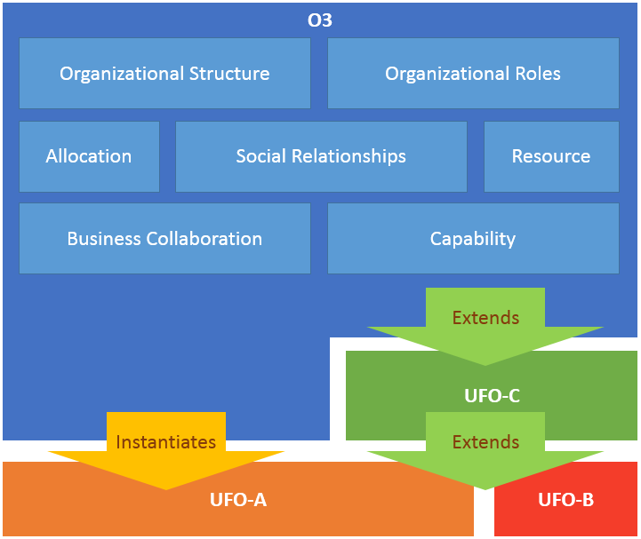
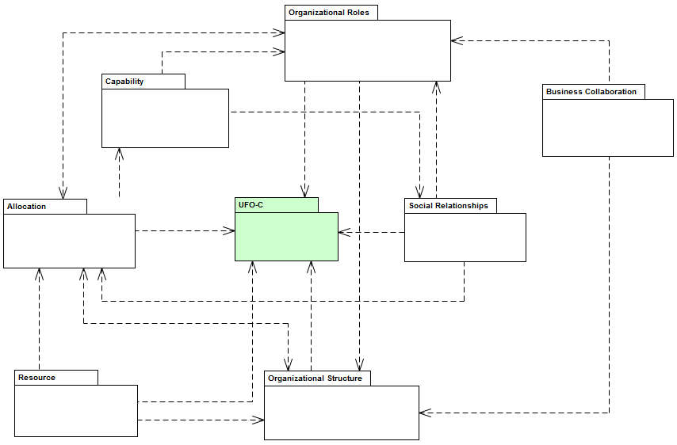

[< Back](../README.md)
---

# The Reference Model

O3 has been defined by extending the social concepts of UFO-C (highlighted in green and orange in O3’s diagrams), such as social role, social agent and physical agent. In this section we present the concepts of O3 described contextually in partial models. We discuss the ontology following the viewpoints defined in O3, namely: (i) organizational structure, (ii) allocation, (iii) organizational roles, (iv) social relationships, (v) capability, (vi) resource and (vii) business collaboration. The following Figure presents an overview about how O3 is organized. 

The Figure bellow details O3’s structure and its dependencies.

Each view presents a coherent set of ontology elements which conform to a specific aspect of interest. The modularization adopted is based on the organizational aspects (previously defined in Section 3.1.1). The definition of each viewpoint was held by aggregating similar or complementary organizational aspects. Table 7 provides a mapping between the established viewpoints and organizational aspects addressed by it.

|Viewpoint | Organizational Aspect |
|----------|-----------------------|
|Organizational Structure | Organizations, Organizational Working Groups, Authority, Geographical Location|
|Organizational Roles|Organizational Roles, External Collaborations, Internal Collaborations |
|Allocation | Organizational Roles, Organizational Members, Organizational Assignment, Geographical Location|
|Social Relationships |Authority, Responsibility |
|Business Collaboration|External Collaborations, Internal Collaborations |
|Capability |Capabilities|
|Resource |Resources |

The following sections describe in detail each viewpoint of the reference ontology.