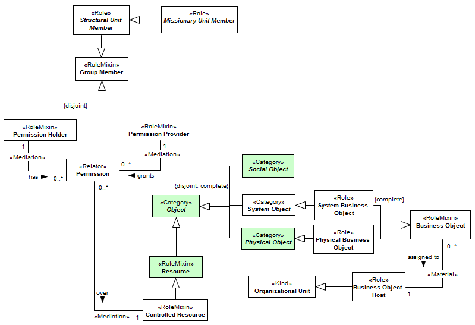
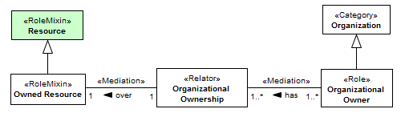

[< Back](../README.md)

---

# Resource View

The resource view describes the organizational resources and their relationships with the organization and its members. Here, resources do not comprise human being as human resources, but only physical and social objects. A resource, in the sense of O3, follows rigorously the definition of resource in UFO-C. As defined in (GUIZZARDI; FALBO; GUIZZARDI, 2008), “only agents (entities capable of bearing intentional moments) can perform actions. An object participating in an action is termed a resource. Agents can be physical (e.g., a person) or social (e.g., an organization, a society). Objects can also be further categorized in physical objects and social objects. Physical objects include a book, a tree, a car; Social objects include money, language and Normative Descriptions”. In addition, we have also system objects, which represent software in general (e.g., an operational system, an ERP). A system object is not an agent, since we consider it cannot bear intentional moments, but have automated characteristics. Thus, this kind of objects participates as resources in actions. The Figure bellow presents an overview of the definition of “resource” merging with UFO-C concepts. 

In the organizational scope, we also have particular objects, which can be possession of someone (owner) and are assigned to some organizational unit (available to the use). These objects are namely business physical objects. Many actions performed in the business context have the participation of resources. When a call center attendant makes a customer service, the description of the process is a social object, the phone used is a physical object and the software that records the occurrence is a system object. 

The access to a resource can be controlled by granting or revoking permissions. Group members (The Figure above) can maintain permissions over resources, as a permission provider or a permission holder. A permission holder can retain many permissions over many resources. On the other hand, as a permission provider, a group member can grant permission for many group members to access many resources. Note that the term “access” comprises use and consume.

The Figure bellow presents the definition of organizational ownership and the roles involved.

An organizational ownership relates organizations with business objects as a possession relationship. The owner in an organizational ownership has certain rights with respect to the object. An ownership can be transferred by sale or donation (the transfer of ownership is out of the scope of our ontology). Despite the abstract nature of social objects, this kind of objects can be visualized as a property. Further, social objects also may have commercial value. An example of social objects owned by organizations includes the TOGAF Framework, Brazilian Real (currency) and ArchiMate modeling language. Despite the fact that system objects are abstract, a registered software has a transferable license which symbolizes the object itself.

---
[< Back](../README.md)