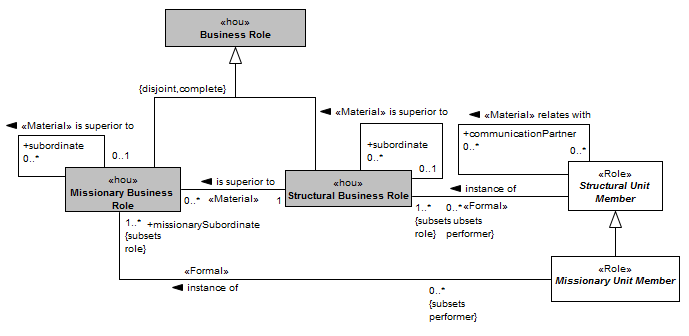
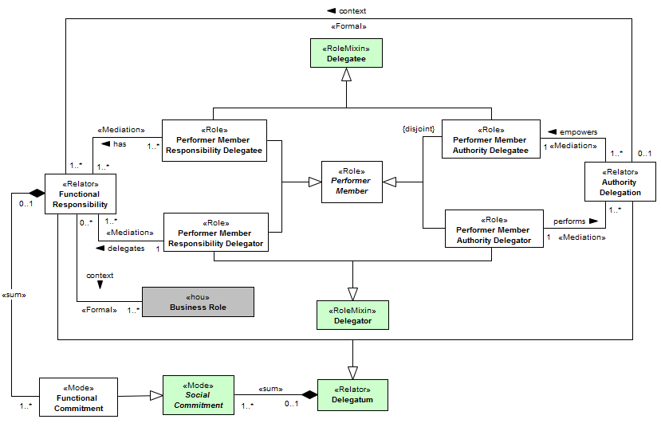

[< Back](../README.md)

---

# Social Relationships View

The social relationships view describes how the members of an organization are related. During the length of stay of an employee in an organization, he/she plays many roles that are internal to the same. These roles formalize the social contract between the employee and the organization, defining the expected behavior and social relationships, like authority and communication. The Figure bellow presents the social relationships that permeate organization members.

As a coordinated environment, authority constitutes a fundamental aspect for organizations. Authority is related with the formal assignment of power to an employee with respect to another. In terms of O3, a formal organization member “is superior to” another. Despite the fact of the “is superior to” relationship be used in many ways between structural business roles and missionary business roles, its meaning varies in according to each use. The reflective authority relationship “is superior to” that occurs between structural business roles and missionary business roles allows the differentiation between the command structure of a department and the command structure of a project, for example. In addition, in many organizations those responsible for projects, task forces and others, are not allocated in the associated missionary unit, but participate giving the directives, constraints and demanding results to the leader of the working group. The power relationship existing between structural business roles and missionary business roles also can be defined through the “is superior to” relationship. 

The establishment of power relationships provides managers a way to achieve the coordination of the actions to fulfill goals. To support horizontalization, cooperation must also be present in social structure. Cross functional processes are performed by multidisciplinary participants in a cooperative way. Cooperation allows the interaction between the participants without the establishment of authority, describing that a member “relates with” another. This relationship also can be viewed as a communication link between the participants.

In some cases, the rigid authority structure is not adequate for agile decision making. Usually, managers delegate part of their authority in favor of breaking down decision barriers. The authority delegation allows empowerment of a performer member to a specific duty (functional responsibility). E.g., a sales manager may delegate authority to a salesman to ensure that a particular sales process is followed. While the delegation is not revoked the salesman has authority over the staff related with the functional responsibility. The Figure bellow illustrates organizational delegations, regarding of authority and functional responsibility.

The goals pursued by an organization can be decomposed at its lowest level of decomposition into tasks (DO; FAULKNER; KOLP, 2003). The distribution of tasks is performed by the assignment of functional responsibilities to its members as duties (delegation). Performer members may have multiple functional responsibilities, carried out in the context of their business roles. Functional responsibilities aggregate many functional commitments. The difference between functional responsibilities and commitments lies on the basic nature of these two concepts. The first represents the delegation of responsibilities to someone, while the last describes the tasks that must be performed. A functional commitment does not represent a specific task, but instead a predisposition to conduct tasks. We choose to not describe the activities related with a specific functional commitment, since behavioral aspects are out of our scope. The user of the ontology can alternatively integrate or extend the ontology to cover behavioral aspects. For this, we recommend the use of the functional commitment concept as a bridge.

The following Table presents the constraints that must be observed on analyzing or instantiating the concepts of the Social Relationships View.

|ID | Description |
|----------|-----------------------|
|AXI19|	A structural role (Structural Business Role) may be superior to structural roles defined by the same organization (Formal Organization) to which it belongs.|
|AXI20|	A team role (Missionary Business Role) can only be superior to team roles defined by the same organization (Formal Organization) to which it belongs.|
|AXI21|	A structural role (Structural Business Role) can only be superior to team roles (Missionary Business Role) defined by the same organization (Formal Organization) to which it belongs.|
|AXI22|	An instance of "Structural Business Role" cannot establish a relationship "is superior to" with itself.|
|AXI23|	An instance of "Missionary Business Role" cannot establish a relationship "is superior to" with itself.|
|AXI24|	An instance of "Structural Unit Member" cannot establish a relationship "relates with" with itself.|
|AXI25|	An instance of “Structural Business Role” cannot establish a relationship “is superior to” with someone that is transitively superior to it.|
|AXI26|	An instance of “Missionary Business Role” cannot establish a relationship “is superior to” with someone that is transitively superior to it.|